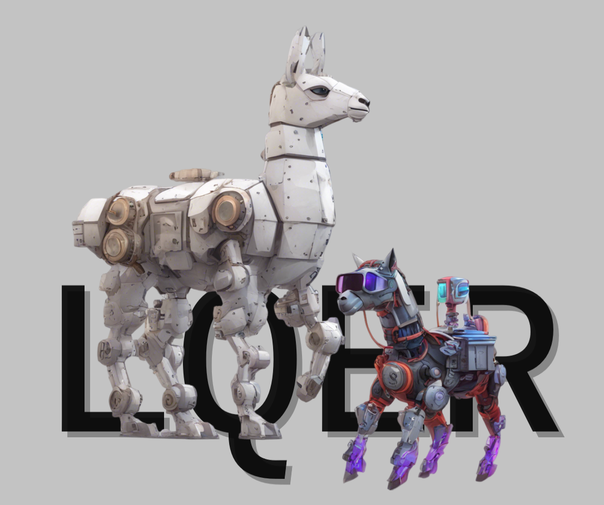

# LQER: <u>L</u>ow-Rank <u>Q</u>uantization <u>E</u>rror <u>R</u>econstruction for LLMs

[ [Paper](https://arxiv.org/abs/2402.02446) ]
[ [Code](https://github.com/ChengZhang-98/big-little-llama/tree/lqer) ]



<details>
<summary> "Big-little" Llama</summary>

LQER runs a high-rank low-precision GEMM and a group of low-rank high-precision GEMMs in parallel to push the limit of lossless LLM PTQ.
</details>

---

LQER is a post-training-quantization method that

- shapes the singular value distribution of approximated quantization error;
- enjoys a static compute pattern and unified memory/compute number formats;
- eliminates the needs of grid search, knowledge distillation, or other forms of iterative optimization.
- achieves near-lossless W4A8 LLM PTQ while using 1.36 $\times$ hardware resources compared to SoTA methods.

## Installation

Anaconda is recommended. Run the following commands to create a conda environment named lqer.

```bash
conda env create -f environment.yml
conda run -n lqer python -m pip install -r requirements.txt
```

Note that this lqer env is for running LQER experiments. The baseline methods such as AWQ, GPTQ, and LLM.int4() included in the paper requires another env setup. Please follow the HuggingFace Transformer quantization guide to replicate baseline results.

## Experiments

### Entry point

Entry point is at [experiments/pipeline/pipeline.py](./experiments/pipeline/pipeline.py). This `pipeline.py` performs data calibration, approximation, software-emulated quantization, perplexity evaluation, and downstream task evaluation for $\text{LQER}$/$\text{L}^2\text{QER}$/no-$\text{LQER}$ quantization.

The `pipeline.py` requires one argument `CONFIG`, which should be a toml file that specifies the experiment settings:

```bash
cd experiments/pipeline
conda run -n lqer python pipeline.py CONFIG
```

Please refer to the toml templates in [./experiments/configs/template](./experiments/configs/template/) for the configuration file format.

### Scripts

Scripts for replicating paper results:

| Script | Note |
| :--- | :--- |
| [experiments/pipeline/sweep_lqer_act.sh](./experiments/pipeline/sweep_lqer_act.sh) | W4A8 $\text{L}^2\text{QER}-\texttt{MXINT}$ |
| [experiments/pipeline/sweep_lqer_act_int.sh](./experiments/pipeline/sweep_lqer_act_int.sh) | W4A8 $\text{L}^2\text{QER}-\texttt{INT}$ |
| [experiments/pipeline/sweep_lqer_svd.sh](./experiments/pipeline/sweep_lqer_svd.sh) | Baseline W4A8 $\text{LQER}-\texttt{MXINT}$ |
| [experiments/pipeline/sweep_baseline_no_lqer.sh](./experiments/pipeline/sweep_baseline_no_lqer.sh) | Baseline W4A8 MXINT w/o $\text{LQER}$ |

Under the hood, these scripts call `pipeline.py` and overwrite the key-value pairs in the passed config template to generate the corresponding experiment setup.

#### Script Usage

Each script requires one argument `CONFIG` and one argument `TAG`. The `CONFIG` should be a config template toml file. The `TAG` is a string that will be used to name the output directory.

```bash
cd experiments/pipeline
./sweep_xxx.sh CONFIG TAG
```

For example, to replicate the W4A8 $\text{L}^2\text{QER}-\texttt{MXINT}$ on LLaMA-7B:

```bash
cd experiments/pipeline
./sweep_lqer_act.sh ../configs/template/llama-7b.toml my-llama-7b-tag
```
