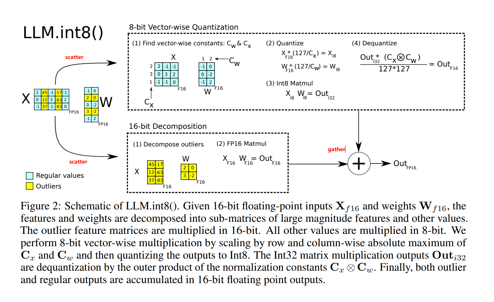

# How to model LLM.int8() and LQER

Note that the circuit area estimation is included in [DeepWok - MASE](https://github.com/DeepWok/mase) rather than this repo. The purpose of this document is to provide the specs of LLM.int8(), LLM.int4(), AWQ, GPTQ, and LQER, and to help the hardware team to implement the circuit area estimation.

## LLM.int8()

Refer to Figure 2 in the [LLM.int8() paper](https://arxiv.org/pdf/2208.07339.pdf):



Given a FP16 matrix multiply $Y=XW$,

At run time:

$X_l, X_h = \mathrm{scatter}_{\tau}(X)$,

$W_l, W_h = \mathrm{scatter}_{\tau}(W)$,

$Y_l = X_lW_l$,

$Y_h = X_hW_h$,

$Y = \mathrm{gather}(Y_l, Y_h)$,

where $\mathrm{scatter}_{\tau}(\cdot)$ decomposes the activation matrix $X$ and weight matrix $W$ into low-precision (subscript $l$) and high-precision (subscript $h$) parts. The high-precision part corresponds to the $X$'s columns (yellow columns of $X$ in Fig.2) that contain the elements larger than a threshold $\tau$. $\mathrm{gather}(\cdot)$ puts the low-precision and high-precision parts back together according to the original order of the columns. Note that $\mathrm{scatter}(\cdot)$ and $\mathrm{gather}(\cdot)$ both include casting operations between FP16 and int8.

### Specs

- `LLM.int8()`: $l$ is 8-bit fixed-point, $h$ is FP16, $\tau$ is 6.0. We'd like a function that estimate the circuit area of a linear layer:

```python
def estimate_area_llm_int8(X_shape, W_shape, num_high_precision_cols):
    """
    Args:
        X_shape: the shape of X, (seq_len, hidden_size_in)
        W_shape: the shape of W, (hidden_size_in, hidden_size_out)
        num_high_precision_cols: the number of high-precision columns in X profiled from the calibration data

    Returns:
        area: the estimated circuit area of the linear layer
    """
    ...

    return area
```

- `LLM.int4()`: $l$ is 4-bit fixed-point, $h$ is FP16, $\tau$ is 6.0.

## AWQ/GPTQ

Given a FP16 matrix multiply $Y=XW$,

At runtime:

$W_h = \mathrm{dequantize}(W_l, g_1, g_2, ..., g_n)$

$Y_h = X_h W_h$

where the low-precision weight $W_l$ is split into $n$ groups of columns, and $i$-th group is multiplied by a high-precision scalar $g_i$ at runtime ($\mathrm{dequantize}$ function). Thus AWQ/GPTQ only saves memory bandwidth, but not compute. For GPU inference of small models, memory bandwidth is the bottleneck. As the model size increases, the compute becomes the bottleneck. Thus AWQ/GPTQ is not useful for large models (AWQ/GPTQ slows down the inference of large models).

### Specs

- `AWQ`/`GPTQ`: $l$ is 4-bit integer, $h$ is FP16, $g_1, g_2, ..., g_n$ are FP16 scalars. We'd like a function that estimates the circuit area of a linear layer:

```python
def estimate_area_awq(X_shape, W_shape, num_groups):
    """
    Args:
        X_shape: the shape of X, (seq_len, hidden_size_in)
        W_shape: the shape of W, (hidden_size_in, hidden_size_out)
        num_groups: the number of groups to split W into

    Returns:
        area: the estimated circuit area of the linear layer
    """
    ...

    return area
```

### Comparison between LQER and GPTQ/AWQ (Ignore this section)

```
Y = XW

X.shape = (seq_len, hidden_size_in)
W.shape = (hidden_size_in, hidden_size_out)

num_multiplies = seq_len * hidden_size_in * hidden_size_out

# GPTQ
W' = scale .* W
Y = XW'

num_multiplies = hidden_size_in * hidden_size_out + seq_len * hidden_size_in * hidden_size_out

# LQER
Y = XW_q + XAB

num_multiplies = seq_len * hidden_size_in * hidden_size_out + seq_len * (hidden_size_in + hidden_size_out) * r

# When LQER has fewer multiplies than GPTQ
LQER - GPTQ < 0
seq_len * (hidden_size_in + hidden_size_out) * r - hidden_size_in * hidden_size_out < 0

seq_len * r < hidden_size_in * hidden_size_out / (hidden_size_in + hidden_size_out)
```

## LQER

Given a FP16 matrix multiply $Y=XW$

During quantization: We have one low-precision matrix $W_l$, and two high-precision small matrices $A_h$, $B_h$ derived from $X$ and $W$.

At run time:

$X_{h,1} = X_h W_l$,

$X_{h,2} = (X_h A_h)B_h$,

$Y = X_{h,1} + X_{h,2}$,

where $X_{h,1}$ and $X_{h,2}$ are the two high-precision parts of the output $Y$. We don't have run-time cost for scatter and gather.

### Specs

- `LQER-int8`: $l$ is 8-bit fixed-point, $h$ is 16-bit fixed-point. Similar to `LLM.int8()`, we'd like a function that estimate the circuit area of a linear layer (using the same unrolling scheme as `LLM.int8()`):

```python
def estimate_area_lqer_int8(Xh_shape, Wl_shape, Ah_shape, Bh_shape):
    """
    Args:
        Xh_shape: the shape of X_h, (seq_len, hidden_size_in)
        Wl_shape: the shape of W_l, (hidden_size_in, hidden_size_out)
        Ah_shape: the shape of A_h, (hidden_size_in, r)
        Bh_shape: the shape of B_h, (r, hidden_size_out)

    Returns:
        area: the estimated circuit area of the linear layer
    """
    ...

    return area
```

- `LQER-int4`: $l$ is 4-bit fixed-point, $h$ is 16-bit fixed-point.

- `LQER-mxint4`: $l$ is 4-bit MXINT, $h$ is 8-bit MXINT.

- `LQER-mxint2`: $l$ is 2-bit MXINT, $h$ is 8-bit MXINT.
